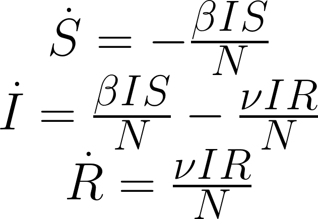
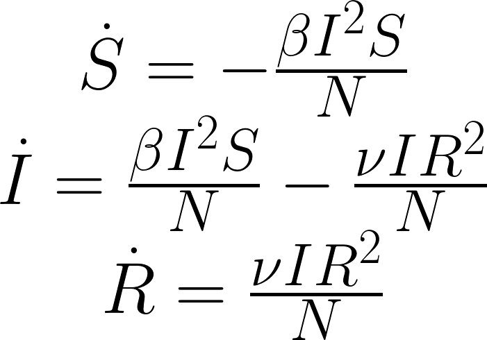
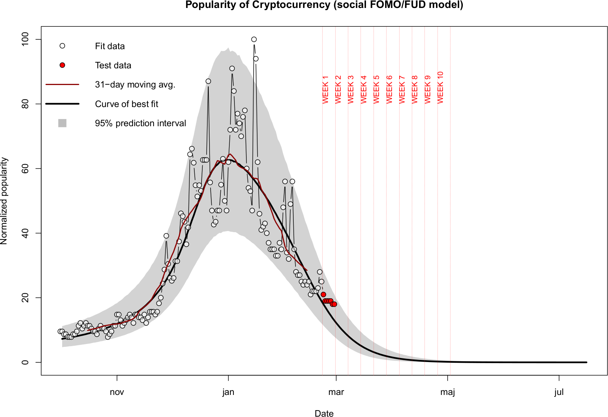
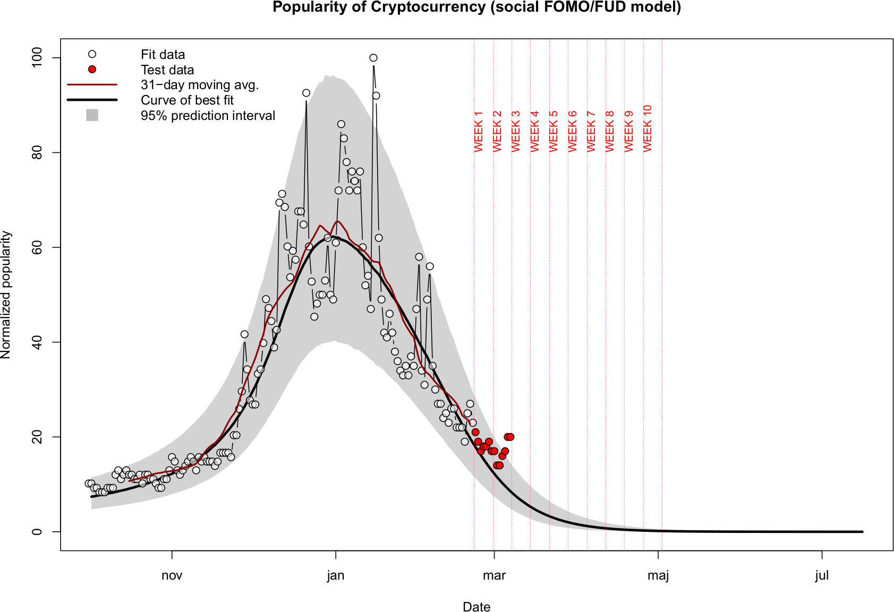

# Is Crypto a bubble?

This project documents my thoughts on the recent unprecedented rise in crypto-currency hype.

------

### Introduction

First of all, a disclaimer is in order. I am a believer in the technology, but I am not a Bitcoin maximalist. I do hold a bit of BTC and various alts. I am also a very late adopter, so my bags are small by many standards :-)

I believe there are valid uses for block-chain and distributed ledger technology, and we are collectively only scratching the surface.

### Background

I think that everyone even vaguely interested in the topic is aware of what is happening in Crypto right now (first two months of 2018). After a massive *bull run* starting in last November and culminating early in January, with Bitcoin reaching an *all time high* of ~20k USD on December 17, the market was hit with a seemingly relentless decline. The Bitcoin value more than halved, but has recently recovered back into the ~10k USD range. The situation follows a [trend](https://medium.com/@Crypto_Sarah9/bitcoin-has-corrected-every-year-between-4th-and-15th-of-january-e624864ba571) that repeats more or less each year like clockwork.

The question is, is this year any different? Is this really the [final popping of the bubble](https://www.nytimes.com/2018/01/29/opinion/bitcoin-bubble-fraud.html)? Or is the growth of Crypto better described by a [(hyper-sensitive) S-Curve of Technological Adoption, which is itself characterized by fractally repeating, exponentially increasing Gartner Hype Cycles](https://medium.com/@mcasey0827/speculative-bitcoin-adoption-price-theory-2eed48ecf7da)?

Is is speculated that the trend in frequency of google searches for "bitcoin", "buy bitcoin", "crypto", "cryptocurrency", and similar, is a leading indicator of corresponding price changes.

Figure 1 below shows the frequency of google searches for "Cryptocurrency" keyword in the past 12 months. Similarly, Figure 2 shows the corresponding total market cap of all cryptocurrencies. The similarity of the two curves is obvious. 

I've checked for the presence of lag between the two curves, but the [cross correlation function](img/cross-correlation.png) has a maximum at zero lag. At the moment, it is difficult discern any causality from this comparison. The cross-correlation function does show slightly higher values for negative values of the lag (indicating that people searching for Crypto precedes the increase in price slightly more often then the other way around).

|             |
| :----------------------------------------------------------: |
| **Figure 1.** *Google Trends data for the "Cryptocurrency" search term* |

|                |
| :----------------------------------------------------------: |
| **Figure 2.** *Total Crypto market cap (CoinMarketVap data)* |

In what I believe is my original contribution I shall describe below the modeling framework that emerged from my other (unfinished) [hobby project](https://github.com/hmatejx/slashdot-ai-hype)...

### Initial attempt based on prior art

First I tried employing the well established infectious recovery [SIR model](https://en.wikipedia.org/wiki/Compartmental_models_in_epidemiology#Bio-mathematical_deterministic_treatment_of_the_SIR_model), which has successfully been used in the past [by](https://arxiv.org/abs/1401.4208) [many](http://i-scover.ieice.org/proceedings/apsitt/2015/pdf/RS-3-2.pdf) [others](https://arxiv.org/abs/1608.07870), myself including, to predict the growth and decline of giant Social Networking Services (SNS) such as [Facebook](https://raw.githubusercontent.com/hmatejx/slashdot-ai-hype/master/img/Facebook_irSIR_fit.png) and [LinkedIn](https://raw.githubusercontent.com/hmatejx/slashdot-ai-hype/master/img/LinkedIn_irSIR_fit.png). 

The irSIR model, expressed by ordinary differential equations, is shown below in Figure 3. Here the letters *S*, *I*, and *R* stand for the susceptible, infected, and recovered part of the population. The factor *N* is just a normalization constant introduced to give a specific meaning to the model parameters beta and nu.

|  |
| :----------------------------------------------------------: |
|                 **Figure 3.** *irSIR model*                  |

The results for Crypto were, in contrast to the success in the SNS setting, *all but satisfactory...*

It quickly dawned on me that within the SNS setting the driving force can be mostly described as passive, "push" based. 

For example, If you start as *S*, you eventually give up to the pressure of your peers, who are already *I*. Likewise, if you are *I*, you start observing your friends leaving and eventually you leave as there is hardly anyone left that you know or care about. This might indeed be a very crude approximation, but it fits nicely with my own anecdotal experience.

Crypto, on the other hand, is *different*. Anybody who has tried to trade and time the market, especially as a rookie, knows what I mean. Even the "seasoned" traders are sometimes subject to it. 

### Improved model of the phenomena (the FOMO/FUD model)

Picture (or remember) the following situation. 

> Observing (in your favorite trading view) the performance of your chosen asset, you see the candles moving rapidly. The volume is rising as well. Learning just beforehand an important bit of news related to your asset, your mind is racing. "It's going to be huge", they said... What should I do? Am I already too late? Oh my, this is moving fast. Without fully being aware of it, you react.

You buy, based on fear. Or you sell, also based on fear. Depending on the situation, of course.

You might fear that you will miss the opportunity of a life-time.  There is even a word for it: [FOMO](https://en.wikipedia.org/wiki/Fear_of_missing_out).  Alternatively, if the news is negative, and the price is rapidly dropping, you might fear that you will loose everything and are already picturing yourself explaining the misfortune to your significant other. While I am not aware of a jargon word describing the later situation, such a situation is often caused by deliberate disinformation. Hence I shall designate this state of fear [FUD](https://en.wikipedia.org/wiki/Fear,_uncertainty_and_doubt).

Fear appears to be much more "pull" based.  In contrast to the push-based dynamics of SNS, in Crypto your brain is trying to estimate the value of belonging to a certain group of the population. If you find yourself in a subgroup that is loosing value, but you also observe another subgroup that is quickly growing in value, you fear of being mispositioned. And you quickly react to fix it.

The simplest approach to mimic your brain's estimation of the perceived value of belonging to a particular subgroup is to simply utilize [Metcalfe's law](https://en.wikipedia.org/wiki/Metcalfe%27s_law). The bigger the (growing) subgroup, the bigger the perceived value of that subgroup, and the value scales as the square of the subgroup size.

The differential equations the FOMO/FUD model (shown below in Figure 4) are therefore similar to irSIR, but the *SI/N* and *IR/N* terms are replaced with *SI^2/N* and *IR^2/N* to reflect the above consideration.

|  |
| :----------------------------------------------------------: |
|                 **Figure 4.** *FOMO/FUD model*                  |

### Details of the approach

The approach is to fit the (normalized) daily Google Trends popularity data for the [Cryptocurrency](https://trends.google.com/trends/explore?q=Cryptocurrency) keyword using the FOMO/FUD model. The data are downloaded by the R script, facilitated by the handy [gtrendsR](https://cran.r-project.org/web/packages/gtrendsR/) package. The downloading is done piecewise to obtain the desired daily precision.

The actual fit of the model to the data is performed in a Bayesian fashion (for no particular reason, I just wanted to practice my skills).

Namely, a generative model is specified that completely describes the data generation process: 

- temporal evolution of the sate using ODEs, and 
- subsequent addition of a Poisson-like noise.

As the absolute scale is not known, the noise is approximated by a normal or log-normal distribution whose width is proportional to the square root of the normalized popularity score. This approach has been shown to adequately describe the observed variability. 

**The key principle is to try to include _all_ uncertainties into the prediction.**

Coupled with weak uninformative priors we can obtain the _posterior predictive distribution_ of the normalized popularity. The fitted model can then also be extrapolated into the future, its probabilistic nature allowing quantification of the uncertainty as well.

The model is implemented in the [Stan](http://mc-stan.org/) probabilistic programming language, which uses the advanced NUTS MCMC sampling algorithm.

Of course, at this point it goes without saying that even a Bayesian approach cannot mitigate the consequences of fitting the wrong model ;-)

### Global fit to 2017-2018 data

The fit to (daily) Google Trends data starting from the beginning of 2017 is shown in Figure 5 below. 

Two things can be noticed immediately. The minor bubbles of June and September (the "pre-peaks") are not well described, which is to be expected. After all, the model is only able to describe a single bubble. Moreover, at early time periods, as well as immediately after the main peak, the lower limit of the 95% prediction interval goes below zero. This is a consequence of the variability being modeled by a normal distribution  and also due to the model's inherent inability to describe the two minor pre-peaks.

|  |
| :----------------------------------------------------------: |
| **Figure 5.** *Fit to the complete 2017 Cryptocurrency Google Trends data* |

### Describing the shape of the main peak

In order to explore if the model is applicable in a more narrowly defined setting, the fit is shown repeated (Figure 6) by considering only data from 2017-10-01 onwards, therefore excluding the two pre-peaks. In addition, the variability model has been replaced by a log-normal distribution, which cannot go below zero and has been found to more closely describe the distribution of the scatter in this particular case.

|  |
| :----------------------------------------------------------: |
| **Figure 6.** *Fit to the December 2017- January 2018 peak* |

Personally, I find it astounding how well the median prediction line (shown in Figure 6 by the thick black curve) matches the 31-day (central) moving average of the Google Trends data. Moreover, in contrast to Figure 5, the width of the 95% prediction interval in Figure 6 is more congruent with the distribution of the raw data.

What is especially significant to me is the tightening of the prediction interval over the next months, providing an extremely sensitive setting for testing the theory by new data in the near future.

### Pitfalls of the approach

This approach implicitly assumes that the public interest drives the underlying value, and not vice versa. In reality, there are time periods where interest lags (chases) the change in value. On the other hand, there are periods where the change in value reflect a spike in public interest.

This indicates that a much more comprehensive system of equations needs to be developed to capture elements of this complex and inter-dependent dynamics.

### Quo vadis, crypto?

Ok, so now what? Is it over? Honestly, I don't know.

One way to utilize the my result above is to monitor the Google Trends data for a possible break outside the 95% prediction interval shown in Figure 6. If the FOMO/FUD assumptions are a reasonable approximation of reality one would expect to see the future trend data to mostly lie within the 95% prediction interval (the decay will continue).

On the other hand, a sustained break-out upwards of the gray zone would indicate the December-January peak was indeed a bubble, but a bubble which has been overlaid on the background of slower rising S-curve of technological adoption. And if this is the case, we may see similar but even larger bubbles in the future (unless this is the last one before the hypothesized plateau of productivity, which I doubt given the currently negligible size of the total Crypto market in comparison to [other established markets](https://www.visualcapitalist.com/worlds-money-markets-one-visualization-2017/)).

I will try to make regular weekly updates below, unless my busy schedule prohibits it.

### So, does this change my mind?

No. Even after this exercise, I am still a believer in future adoption. For me, this was just an exploration of ideas in a well defined, simplified sandbox. 

Lastly, I take all my models predicting the future with a huge grain of salt (and making models *is* my daily bread and butter!). After all. the future cannot be predicted as much as it can be influenced.

#### Week 1 test

|  |
| :----------------------------------------------------------: |
| **Figure 7.** *Model testing (week 01):  2018/02/22 — 2018/03/08* |

The red dots remain within the gray band. Even though they are all above the median, we should wait for more data before confirming a breakout.

#### Week 2 test

|  |
| :----------------------------------------------------------: |
| **Figure 8.** *Model testing (week 02):  2018/03/04 — 2018/03/10* |

**There is a breakout!** But it could also be just negative publicity connected to news about the MtGox BTC being sold by the trustee.... I guess next weak will show is this will revert back to the expectation, or if the break-out is indeed sustained, and the next phase of growth is starting.

### Changelog

- **February 26.** Initial GitHub pages version.
- **March 4.** Week 1 test, minor edits, spelling corrections.
- **March 10.** Week 2 test, removed the erroneous "well established" claim about the leading/lagging (I should have researched more instead of blindly believing what I read).